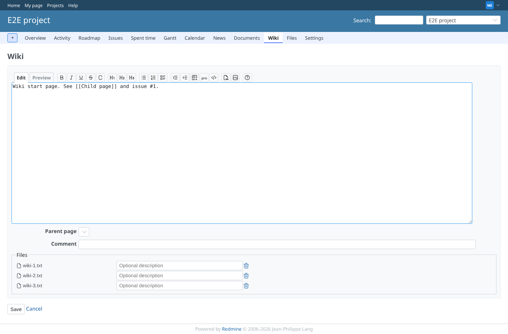
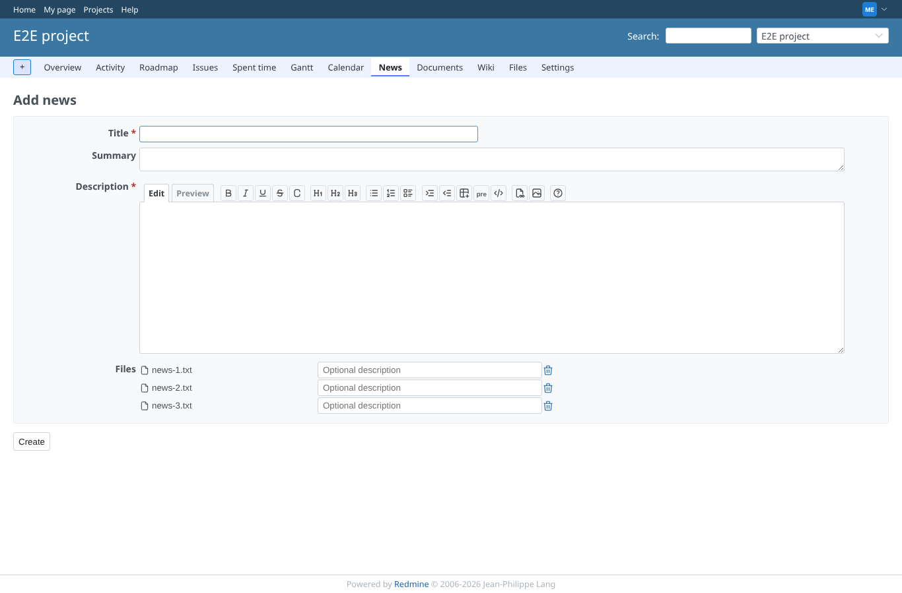
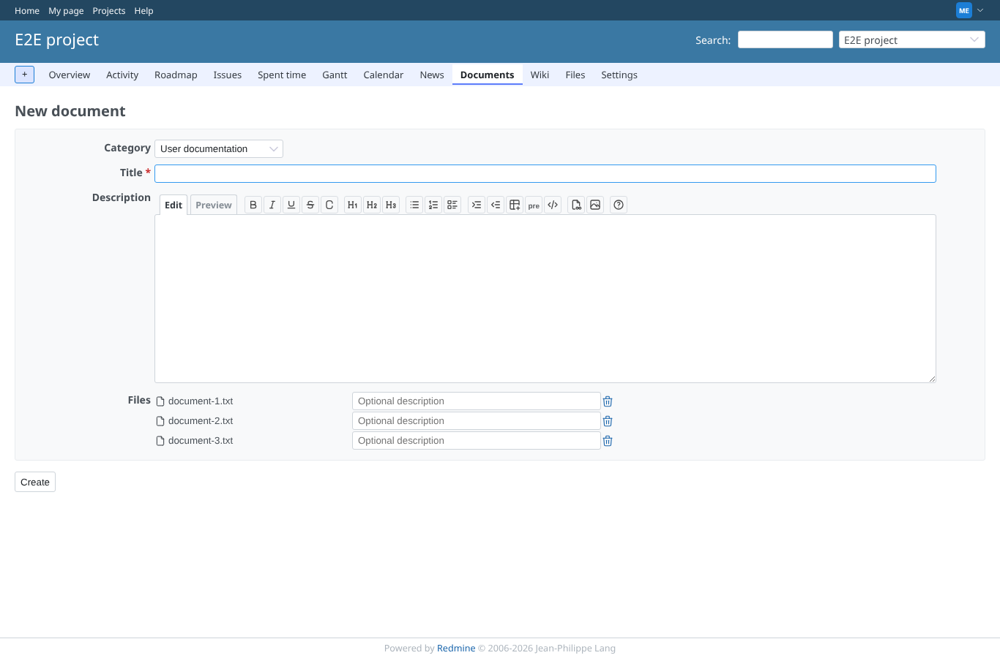
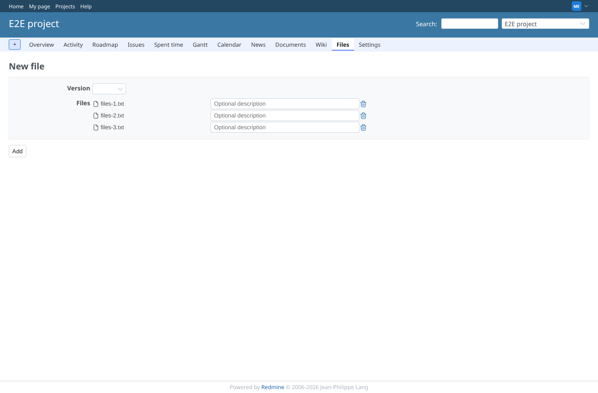
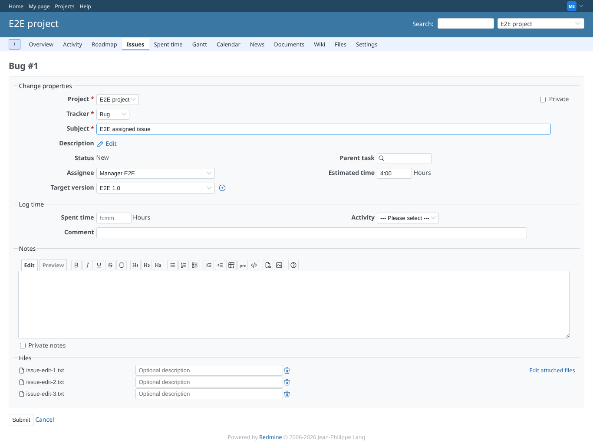

# other-forms

Run 2026-10-07T16:03:21.487Z against http://127.0.0.1:3000.

| screenshot | user | URL | shows |
|---|---|---|---|
|  | manager | `/projects/e2e-project/wiki/Wiki/edit` | wiki: 4 files picked, 3 kept, alert shown, add button gone |
|  | manager | `/projects/e2e-project/news/new` | news: 4 files picked, 3 kept, alert shown, add button gone |
|  | manager | `/projects/e2e-project/documents/new` | document: 4 files picked, 3 kept, alert shown, add button gone |
|  | manager | `/projects/e2e-project/files/new` | files: 4 files picked, 3 kept, alert shown, add button gone |
|  | manager | `/issues/1/edit` | issue-edit: 4 files picked, 3 kept, alert shown, add button gone |
