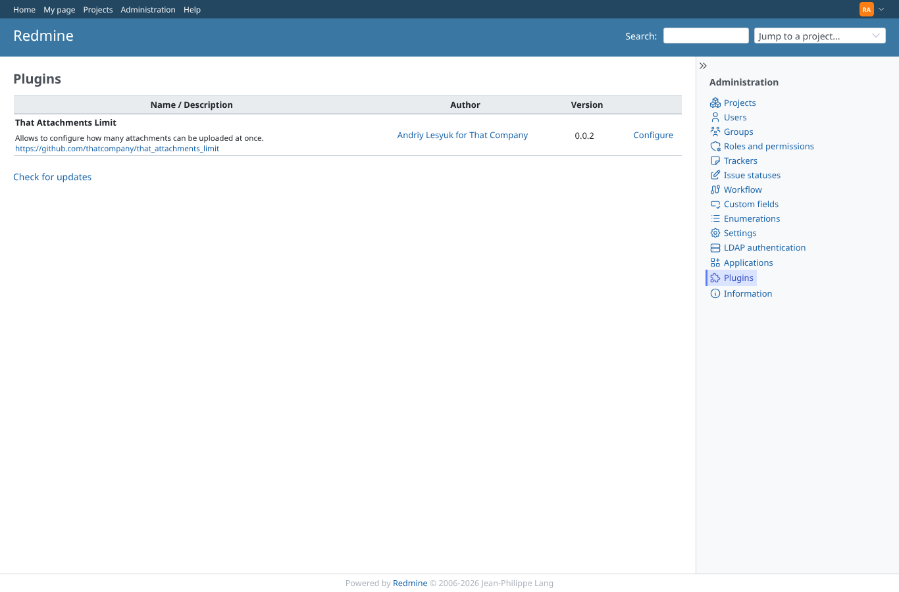
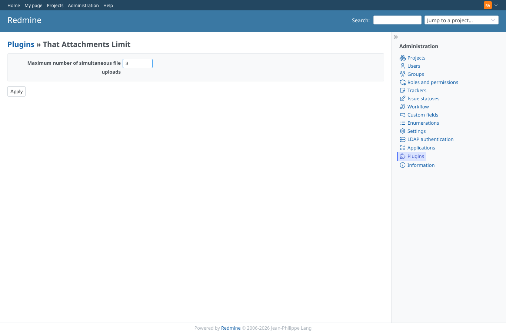
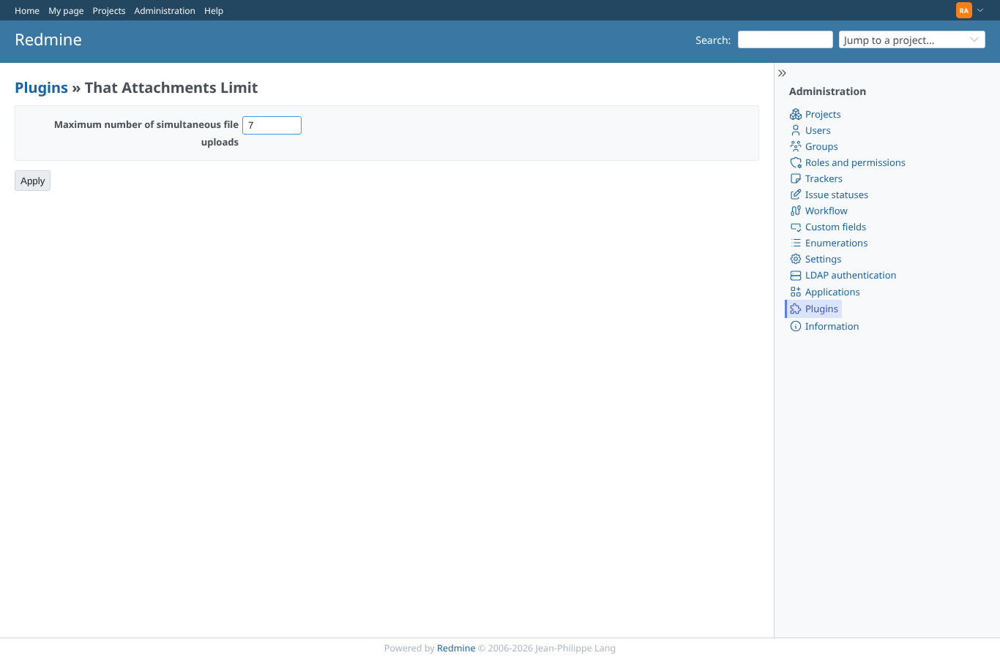
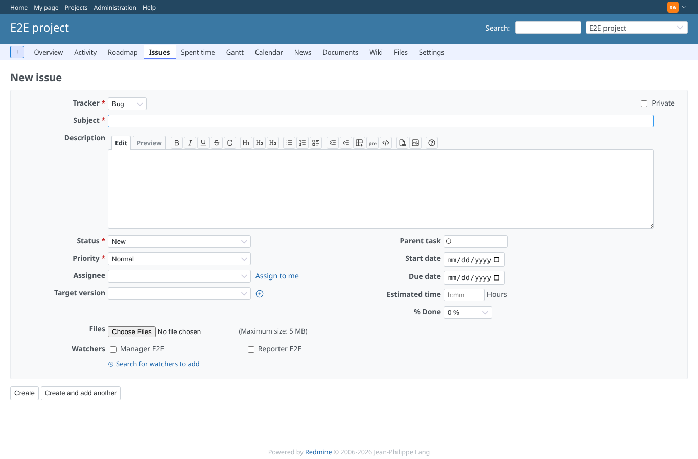

# settings

Run 2026-10-06T19:32:42.275Z against http://127.0.0.1:3000.

| screenshot | user | URL | shows |
|---|---|---|---|
|  | admin | `/admin/plugins` | The plugin is listed with a Configure link |
|  | admin | `/settings/plugin/that_attachments_limit` | The settings form with the seeded value 3 |
|  | admin | `/settings/plugin/that_attachments_limit` | After saving 7 the form shows 7 (flash message gone after reload) |
|  | admin | `/projects/e2e-project/issues/new` | A blank/invalid setting makes the issue form use 10 (last tried: empty) |
|  | manager | `/settings/plugin/that_attachments_limit` | A project manager (not an administrator) is refused (403) |
|  | reporter | `/settings/plugin/that_attachments_limit` | A member without permissions is refused (403) |
|  | anonymous | `/login?back_url=http%3A%2F%2F127.0.0.1%3A3000%2Fsettings%2Fplugin%2Fthat_attachments_limit` | Anonymous is redirected to the login page |
