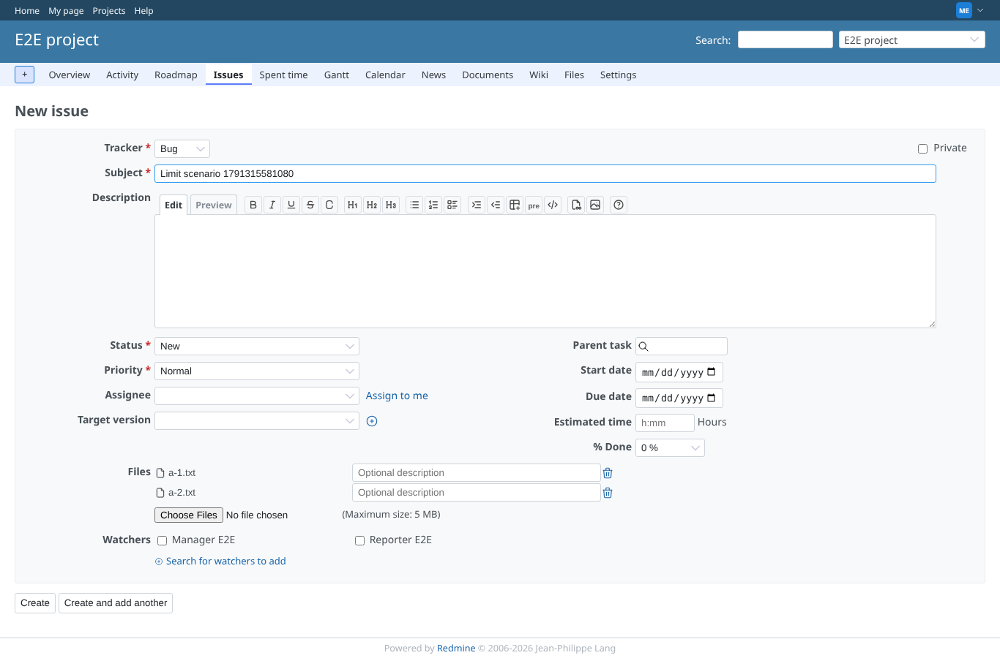
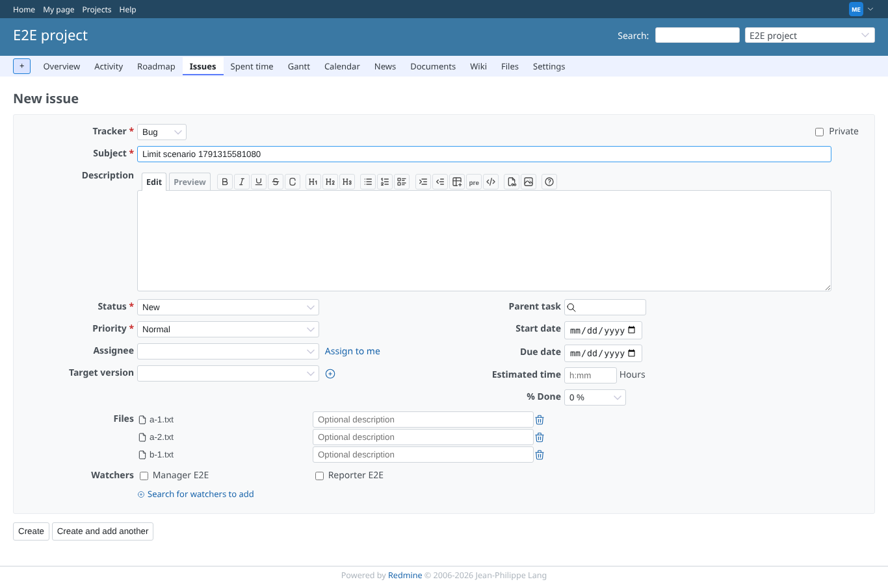
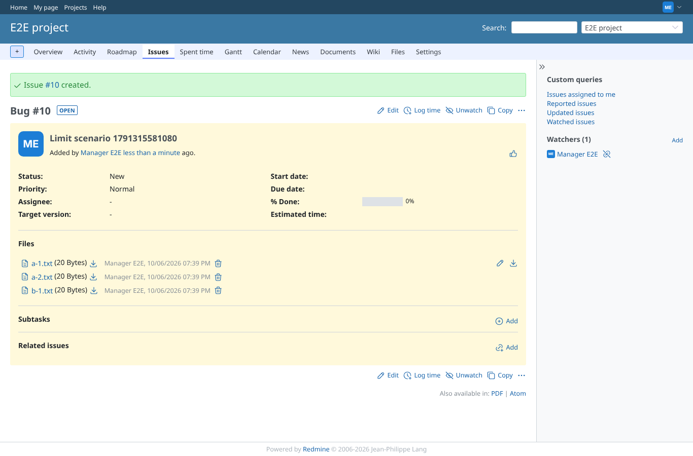
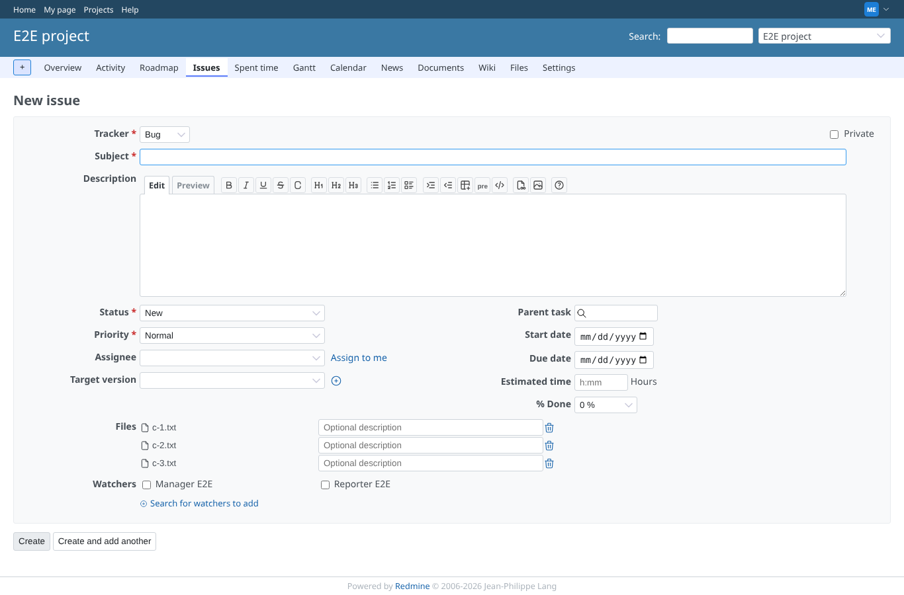
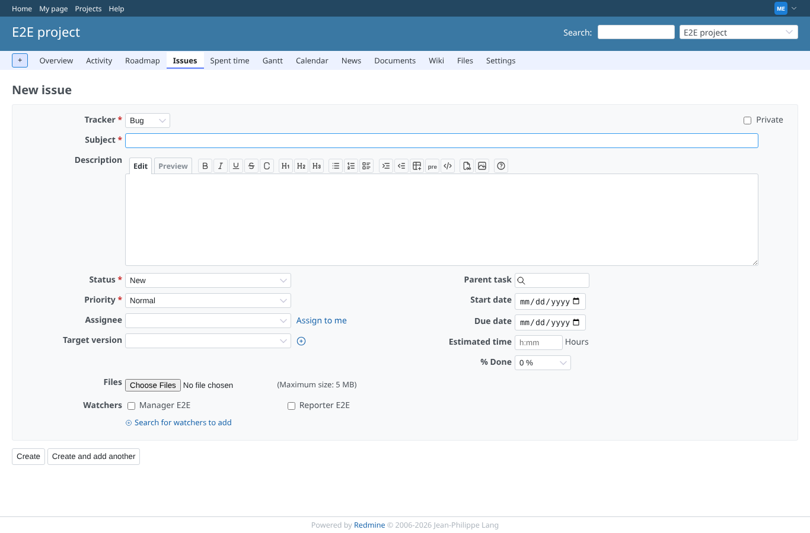
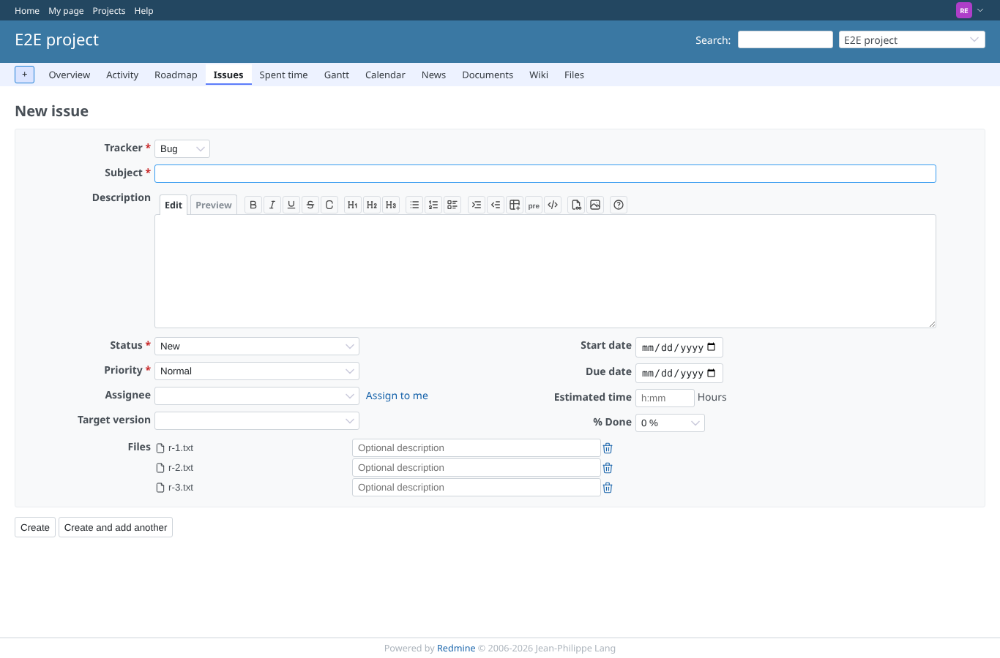

# upload-limit

Run 2026-10-06T19:39:53.500Z against http://127.0.0.1:3000.

| screenshot | user | URL | shows |
|---|---|---|---|
|  | manager | `/projects/e2e-project/issues/new` | Two files uploaded, the add button is still there (limit 3) |
|  | manager | `/projects/e2e-project/issues/new` | Three files uploaded, the add button is gone, no alert |
|  | manager | `/issues/10` | The issue is saved with all three attachments |
|  | manager | `/projects/e2e-project/issues/new` | Five files at once: only 3 are kept; alert text: "This file cannot be uploaded because it exceeds the maximum number of files that can be attached simultaneously (3)" |
|  | manager | `/projects/e2e-project/issues/new` | 1 file present, 3 dropped: the list stops at 3 and the alert is shown |
|  | manager | `/projects/e2e-project/issues/new` | A 6 MB file is refused; alert "This file cannot be uploaded because it exceeds the maximum allowed file size (5 MB)" |
|  | reporter | `/projects/e2e-project/issues/new` | A member without special permissions is held to the same limit |
|  | outsider | `/projects/e2e-private/issues/new` | An outsider cannot reach the upload form of a private project |
|  | anonymous | `/login?back_url=http%3A%2F%2F127.0.0.1%3A3000%2Fprojects%2Fe2e-project%2Fissues%2Fnew` | Anonymous cannot reach the upload form: redirected to the login |
